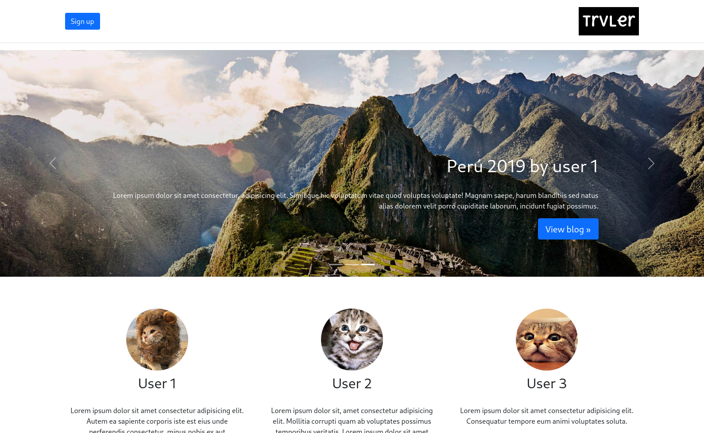
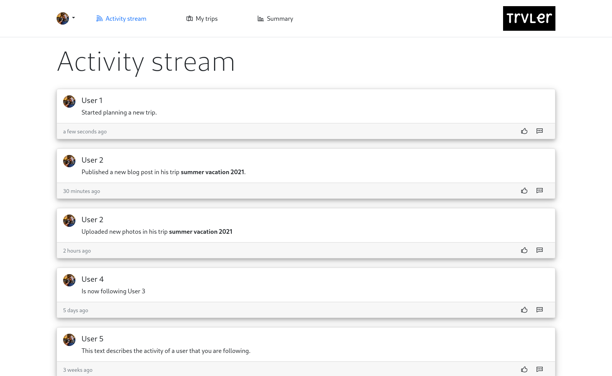
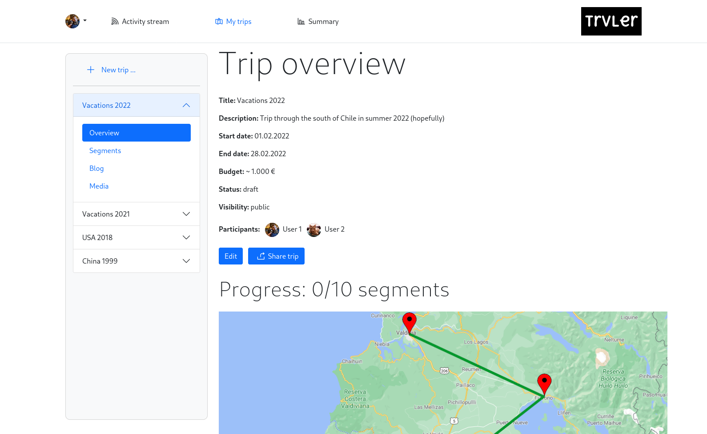
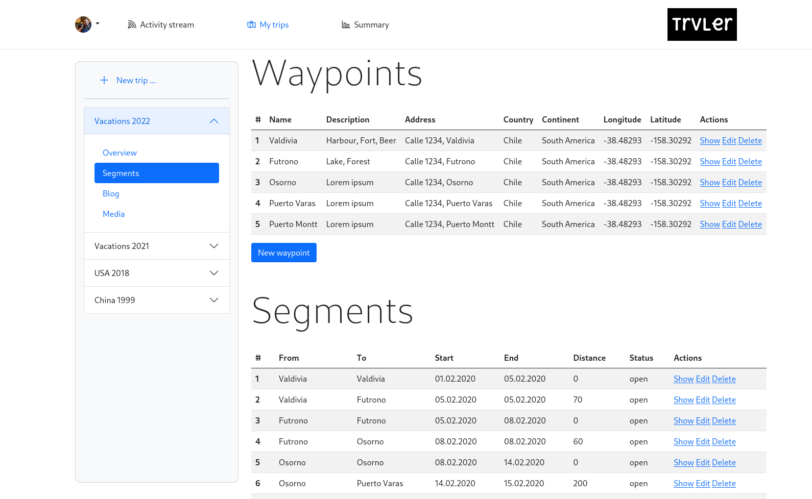
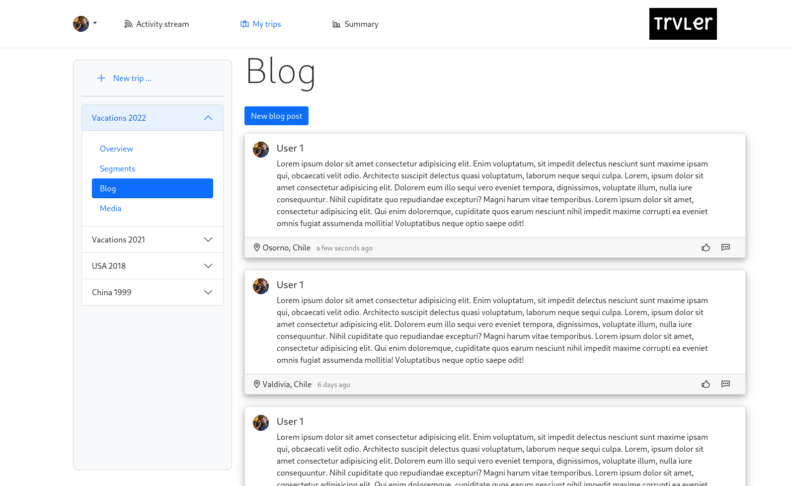
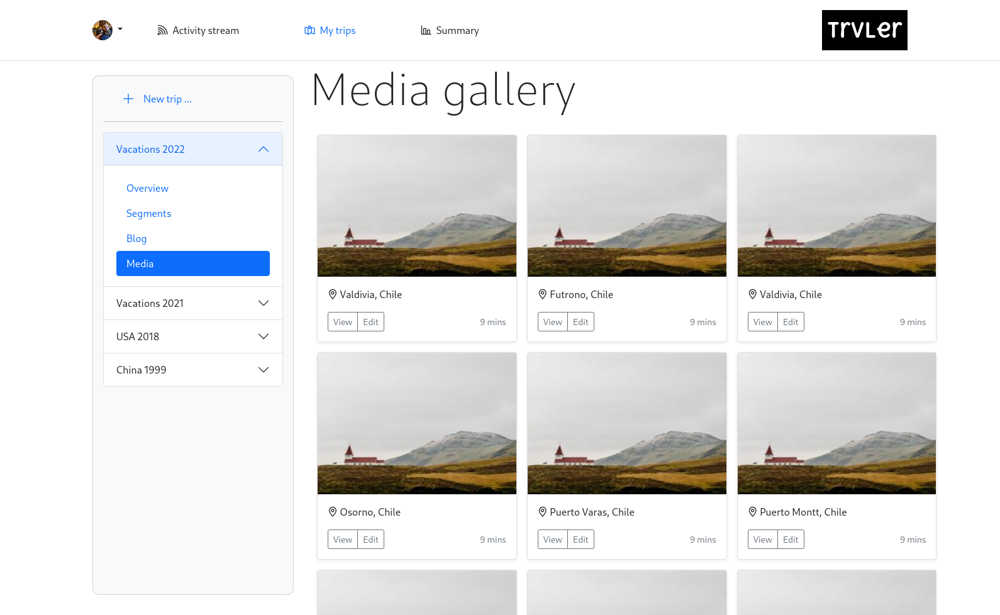
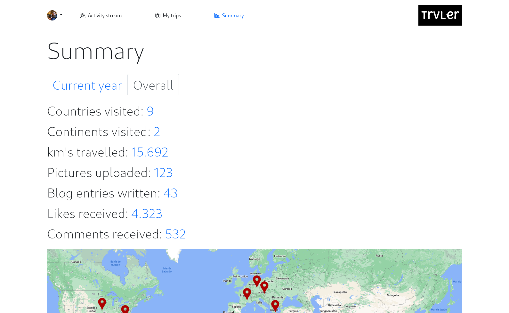
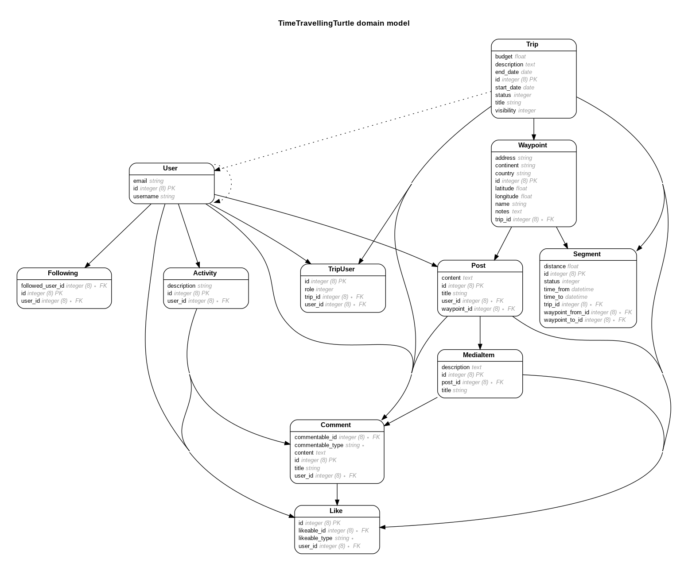

# Final project for fullstack-g39
This is the final project of the bootcamp "Fullstack development", generation 39, of academia desafío latam.  
The objective of this project was to create a platform to plan, document and share trips.

# Index
[Links](#links)  
[Used versions](#used-versions)  
[Mockups](#mockups)  
[ERD](#erd)  
[Deployment](#deployment)

# Links
## Trello
https://trello.com/b/FINbe47p/time-travelling-turtle

## DB design
https://dbdiagram.io/d/60722617ecb54e10c33faa66

## Live version
https://www.trvlr.cl

# Used versions
ruby: `3.0.1`  
rails: `6.1.3.2`

# Mockups
Following are the initial mockups that were created during the design phase.

## Visitors


## Activity stream


## My trips - overview


## My trips - segments


## My trips - blog


## My trips - media


## Summary page


# ERD

Note: also avaliable as PDF in `docs/erd.pdf`  
It was generated using the gem `rails-erd` by running the command
```bash
rails erd indirect=true attributes=foreign_keys,primary_keys,content filetype=pdf filename=doc/erd
```

# Deployment
Deployment is pretty straight forward. You will need a running postgres server and the ruby and rails versions mentioned above under [used versions](#used-versions).

## Clone repository
```bash
git clone https://github.com/chrila/time-travelling-turtle.git
```

## Install gems
```bash
cd time-travelling-turtle
bundle install
```

## Run migrations
Make sure that the postgres server is running.
```bash
rails db:migrate
```

## Run seed
If desired, you can populate the DB with test data.
```bash
rails db:seed
```

## Start the server
```bash
rails s
```

## Open website
http://localhost:3000
