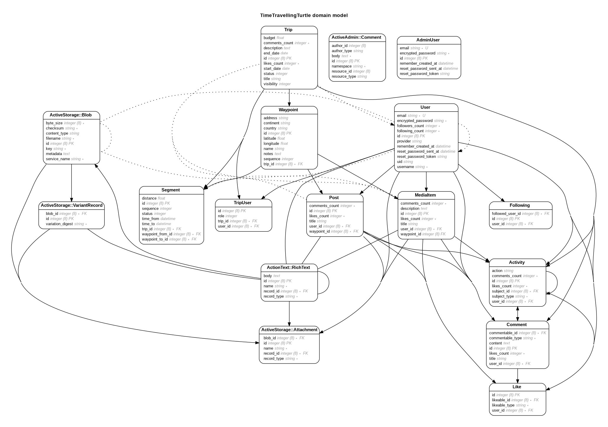

# Proyecto final para fullstack-g39
Este es el proyecto final de la carrera "desarrollo fullstack", generación 39, de la Academia Desafío Latam.

El objetivo de este proyecto es crear una plataforma para planificar, gestionar, documentar y compartir viajes.

## Links
### Trello
https://trello.com/b/FINbe47p/time-travelling-turtle

### DB design
https://dbdiagram.io/d/60722617ecb54e10c33faa66

### Live version
http://www.trvlr.cl

## Versiones
ruby: 3.0.1 \
rails: 6.1.3.1

## Mockups
### Visitantes


### Activity stream


### My trips - overview


### My trips - segments


### My trips - blog


### My trips - media


### Summary page


## ERD

Nota: también está disponible cómo PDF en docs/erd.pdf \
Se lo generó usando la gema `rails-erd` con el comando
```bash
rails erd indirect=true attributes=foreign_keys,primary_keys,content filetype=pdf filename=doc/erd
```
